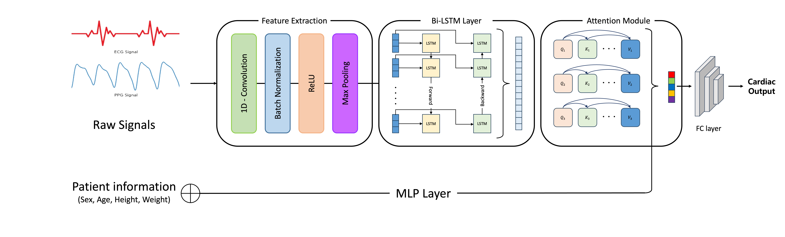

# Non-Invasive Cardiac Output Estimation(baseline)

PPG/ECG 신호와 환자 정보(성별, 나이, 신장, 체중)로 심박출량(CO, L/min)을 비침습적으로 추정합니다.

현재 저장소에는 1D CNN + BiLSTM + Self-Attention  모델이 포함되어 있으며, 이후 모델이 순차적으로 추가됩니다.

---

## Models

| Model | Directory |
|-------|-----------|
| 1D CNN + BiLSTM + Self-Attention (baseline) | `1D-CNN BiLSTM Attention/` |


---

## Model Architecture (1D CNN + BiLSTM + Self-Attention)



| Component | Description |
|-----------|-------------|
| `CNN1D` | 4-block 1D convolution for local feature extraction |
| `BiLSTM` | Bidirectional LSTM for temporal dependency modeling |
| `SignalAttention` | Window-based self-attention per signal stream |
| `MLP` | Patient metadata encoding (Sex, Age, Ht, Wt) |
| `FusionAttention` | Attention fusion across PPG, ECG, and patient streams |

---

## Project Structure

```
.
├── train.py                      # 학습 진입점
├── evaluate.py                   # 평가 및 시각화
├── config.py                     # 하이퍼파라미터 설정
├── requirements.txt
├── data/
│   └── dataset.py                # PPGECGDataset, 전처리, DataLoader 빌더
├── models/
│   └── cnn_bilstm_attention.py   # 모델 컴포넌트 및 SignalProcessingModel
└── utils/
    ├── metrics.py                # MSE / RMSE / MAE / R2 / MAPE 계산
    ├── early_stopping.py         # EarlyStopping
    └── bland_altman.py           # Bland-Altman 플롯
```

---

## 데이터 형식

| File | Description |
|------|-------------|
| `Train.pkl` | Train data |
| `Val_df_final.pkl` | validation data |
| `Test.pkl` | test data |

| Column | Type | Description |
|--------|------|-------------|
| `ppg` | array | PPG Time-series signal(20s) |
| `ecg` | array | ECG Time-series signal(20s) |
| `Sex` | float | Gender |
| `Age` | float | Age |
| `Ht` | float | Ht (cm) |
| `Wt` | float | Wt (kg) |
| `co` | float | CO (L/min) |
| `pid` | int | Randomized id |
---

## install

```bash
pip install -r requirements.txt
```

In a GPU environment, install the version of PyTorch compatible with your CUDA version from the [PyTorch official website](https://pytorch.org/get-started/locally/).

---

## Usage

### Training

```bash
python train.py
```

Hyperparameters are modified in `config.py`.

```python
# config.py
CONFIG = {
    'data_dir':   '.',        # pkl 파일 위치
    'save_dir':   './results', # 체크포인트 및 결과 저장 경로
    'epochs':     200,
    'learning_rate': 8e-4,
    ...
}
```

The processing is complete, the following files will be created in the `results/` directory.

```
results/
├── best_model.pth           # 최적 체크포인트
├── evaluation_results.csv   # 샘플별 예측 결과
├── patient_summary.csv      # 환자별 지표 요약
├── scatter_plot.png         # 실제 vs 예측 산점도
├── error_distribution.png   # 예측 오차 분포
└── bland_altman_plot.png    # Bland-Altman 플롯
```

### Evaluation

```python
import torch
from models.cnn_bilstm_attention import SignalProcessingModel
from evaluate import evaluate_and_visualize

device = torch.device('cuda' if torch.cuda.is_available() else 'cpu')
model = SignalProcessingModel().to(device)
model.load_state_dict(torch.load('results/best_model.pth', map_location=device))
results = evaluate_and_visualize(model, test_loader, device, save_path='./results')
```
