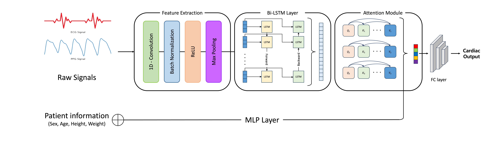

# Non-invasive cardiac output estimation — baseline model

Cardiac output (CO, L/min) is estimated from PPG and ECG signals together with patient demographics (sex, age, height, weight).

This is the baseline model used for comparison in the paper. It is fully self-contained and reproducible.

---

## Model architecture

<p align="center">
  
</p>

| Component | Description |
|---|---|
| `CNN1D` | 4-block 1D convolution (channels: 1→32→64→128→256) for local feature extraction |
| `BiLSTM` | 3-layer bidirectional LSTM (hidden=256, output=512) for temporal dependency modeling |
| `SignalAttention` | Window-based local self-attention per signal stream; returns a single context vector via mean-pooling |
| `MLP` | Patient metadata encoder: (4,) → (64,) → (256,) with BatchNorm and Dropout |
| `FusionAttention` | Self-attention across the 3 modality vectors (PPG, ECG, patient info); residual + LayerNorm |
| `output_head` | Linear(768 → 1) predicting CO in L/min |

---

## Project structure

```
1D-CNN BiLSTM Attention/
├── train.py                      # Training entry point
├── evaluate.py                   # Evaluation and visualization
├── config.py                     # Hyperparameter configuration
├── requirements.txt
├── data/
│   └── dataset.py                # PPGECGDataset, preprocessing, DataLoader builder
├── models/
│   └── cnn_bilstm_attention.py   # Model components and SignalProcessingModel
└── utils/
    ├── metrics.py                # MSE / RMSE / MAE / R² / MAPE
    ├── early_stopping.py         # EarlyStopping (patience-based, val loss)
    └── bland_altman.py           # Bland-Altman plot and PE calculation
```

---

## Data

The training scripts expect three `.pkl` files containing a pandas DataFrame with the following columns:

| File | Description |
|---|---|
| `Train.pkl` | Training set |
| `Val_df_final.pkl` | Validation set |
| `Test.pkl` | Test set |

| Column | Type | Description |
|---|---|---|
| `ppg` | array (2500,) | PPG time-series, 20 s at 125 Hz |
| `ecg` | array (2500,) | ECG time-series, 20 s at 125 Hz |
| `Sex` | float | Biological sex |
| `Age` | float | Age in years |
| `Ht` | float | Height (cm) |
| `Wt` | float | Weight (kg) |
| `co` | float | Cardiac output (L/min) — thermodilution reference |
| `pid` | int | Anonymized patient ID |

Data are not included in this repository. See the root README for the cohort description.

---

## Installation

```bash
pip install -r requirements.txt
```

For GPU training, install the PyTorch build matching your CUDA version from [pytorch.org](https://pytorch.org/get-started/locally/).

---

## Usage

Run all commands from inside this directory (`1D-CNN BiLSTM Attention/`).

Place your `.pkl` data files in this directory (or update `data_dir` in `config.py`).

### Training

```bash
python train.py
```

Key configuration options in `config.py`:

```python
CONFIG = {
    'data_dir':              '.',      # directory containing Train.pkl, Val_df_final.pkl, Test.pkl
    'save_dir':              './results',
    'epochs':                200,
    'early_stopping_patience': 30,
    'learning_rate':         8e-4,
    'weight_decay':          1e-3,
    'hidden_size':           256,
    'lstm_layers':           3,
    'dropout':               0.3,
    'batch_size':            64,
    'max_len':               2500,
    'grad_clip_norm':        0.3,
}
```

`train.py` prints a PID overlap check at startup to confirm no data leakage across splits.

After training, the following files are saved to `results/`:

```
results/
├── best_model.pth           # Best checkpoint (lowest val loss)
├── evaluation_results.csv   # Per-segment predictions and patient-level metrics
├── patient_summary.csv      # Per-patient metric summary (mean ± std)
├── scatter_plot.png         # Actual vs. predicted CO scatter plot
├── error_distribution.png   # Prediction error histogram
└── bland_altman_plot.png    # Bland-Altman plot with PE
```

### Evaluation on a saved checkpoint

```python
import torch
from models.cnn_bilstm_attention import SignalProcessingModel
from evaluate import evaluate_and_visualize
from data.dataset import build_loaders
from config import CONFIG

device = torch.device('cuda' if torch.cuda.is_available() else 'cpu')
model = SignalProcessingModel().to(device)
model.load_state_dict(
    torch.load('results/best_model.pth', map_location=device, weights_only=True)
)

import pandas as pd
test_df = pd.read_pickle('Test.pkl')
_, _, test_loader = build_loaders(
    pd.read_pickle('Train.pkl'),
    pd.read_pickle('Val_df_final.pkl'),
    test_df,
    CONFIG,
)
results = evaluate_and_visualize(model, test_loader, device, save_path='./results')
```

---

## Results (internal test set, SMC)

| Metric | Value |
|---|---|
| RMSE | 1.325 L/min |
| MAE | 1.12 L/min |
| R² | 0.234 |
| Mean bias | 4.2% |
| PE | 42.1% |

See the root README for the full model comparison table.
