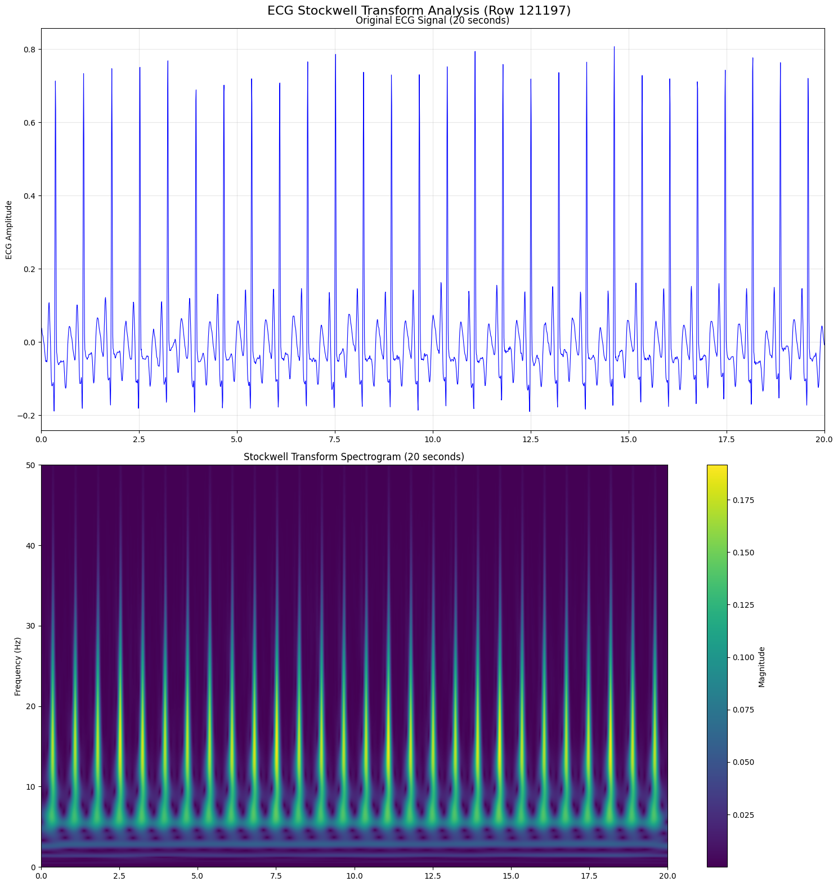
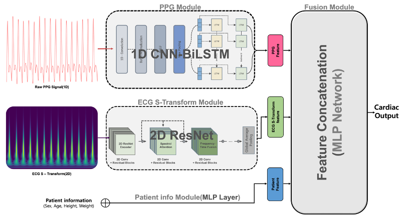
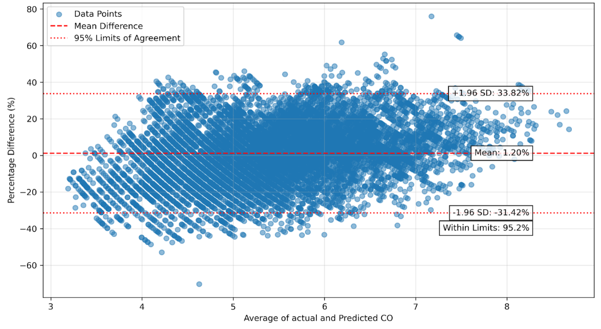

# Multimodal Fusion for Non-invasive Cardiac Output Prediction in ICU

> **Best Paper Award** (Samsung Advanced Institute of Health Science & Technology President's Award)  
> 2025 Digital Bio Talent Development Conference

Cardiac output (CO) is one of the most critical hemodynamic parameters in the ICU, but its gold standard — thermodilution via pulmonary artery catheter — is invasive and carries real clinical risk. This work predicts CO non-invasively by fusing ECG, PPG, and basic patient demographics through three independent deep learning branches.

---

## Why S-Transform for ECG?

Before training, each ECG segment is converted to a 2D time-frequency image using the Stockwell Transform (S-Transform), rather than feeding the raw waveform directly into the network.

A 1D ECG waveform carries morphological information — P-wave shape, QRS width, T-wave amplitude. Its time-frequency representation captures a completely different layer of information: spectral energy distribution and how it shifts over time. These two views are fundamentally different, which is why splitting ECG and PPG into separate branches (rather than merging everything into one encoder) makes sense. The ECG branch focuses on spectral structure; the PPG branch handles waveform dynamics.

S-Transform was chosen over STFT and wavelet transforms for two concrete reasons:

1. **Phase preservation**: the S-Transform retains the absolute phase spectrum (unlike magnitude-only spectrograms from STFT), which matters for detecting subtle waveform shifts that indicate changes in ventricular function
2. **Frequency-dependent resolution**: the analysis window scales inversely with frequency, so slow hemodynamic components and fast QRS transients are each resolved at an appropriate scale — this is the property borrowed from the wavelet transform, while keeping STFT's linear frequency axis

The resulting `(599 × 2500)` matrix maps naturally to a standard 2D ResNet input. Convolutional filters can then learn local patterns across both axes simultaneously — for example, a filter that responds to energy concentrated in a specific frequency band at a specific timing relative to the cardiac cycle.

---

## Data Preprocessing

ECG signals are converted to S-Transform representations before training using [`S-Transform_test.ipynb`](./S-Transform_test.ipynb). The notebook applies the transform segment by segment and stores the output in the training pickles alongside the raw PPG.

**Example: 1D ECG → 2D S-Transform**



---

## Architecture

Three branches process each modality independently. Their output features are concatenated and passed through a fusion MLP to predict CO.

| Branch | Input | Model | Output dim |
|--------|-------|-------|-----------|
| PPG | `(B, 2500, 1)` | 1D CNN → BiLSTM | 256 |
| ECG | `(B, 1, 599, 2500)` | 2D ResNet + Spectral Attention + Freq-Time Fusion | 256 |
| Patient info | `(B, 4)` | MLP | 64 |
| Fusion | `(B, 576)` | MLP | 1 |



**ECG branch detail**: after each residual stage, a `SpectralAttentionBlock` recalibrates activations across the frequency, time, and channel axes. Between the second and third stages, a `FrequencyTimeFusion` block applies separate vertical (frequency-axis) and horizontal (time-axis) convolutions, then adds them back via a residual connection. This pushes the network to capture cross-axis interactions that plain isotropic kernels tend to miss.

**PPG branch detail**: four convolutional stages progressively compress the sequence length (2500 → 39), then a two-layer BiLSTM captures temporal dependencies across the resulting feature steps.

---

## Results

Patient-level split — no segment overlap between train, validation, and test sets.

| Metric | Value |
|--------|-------|
| RMSE | 0.832 L/min |
| MAE | 0.780 L/min |



Bland-Altman: mean bias 0.7%, 95% limits of agreement −31.42% to +33.62%, PE 32.62%. These numbers are from the internal development evaluation (SMC test set). See the root README for the full model comparison table.

---

## Getting Started

### Prerequisites

```
torch
numpy
pandas
scikit-learn
stockwell
```

### 1. Preprocess ECG signals

Run `S-Transform_test.ipynb` to apply the S-Transform and export `train.pkl`, `val.pkl`, and `test.pkl`.

Each pickle should contain:

| Column | Shape | Notes |
|--------|-------|-------|
| `ppg` | 1-D array (2500,) | Raw waveform at 125 Hz (20 s) |
| `ecg_s_transform` | `(599, 2500)` | S-Transform output |
| `Sex`, `Age`, `Ht`, `Wt` | scalar | Patient demographics |
| `co` | scalar | Cardiac output (L/min) |

### 2. Verify model shapes (no data needed)

```bash
python multimodal_co_prediction.py
```

### 3. Load for training

```python
from multimodal_co_prediction import MultimodalCOPredictor, build_dataloaders

train_loader, val_loader, test_loader = build_dataloaders(data_dir='./')
model = MultimodalCOPredictor()
```
