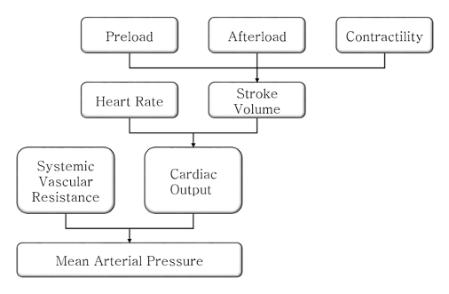
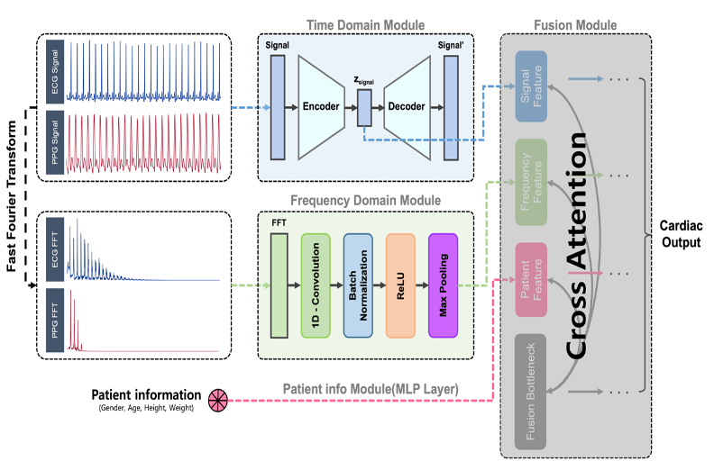
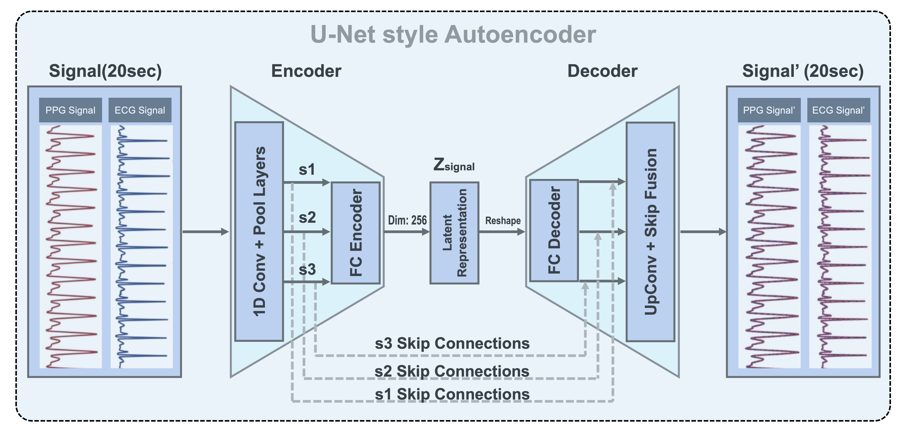
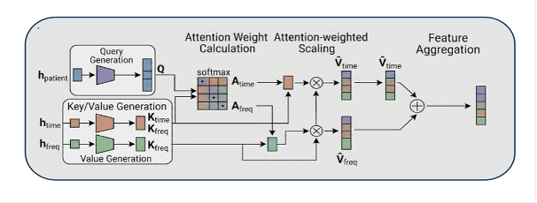
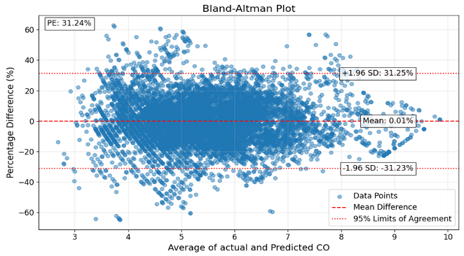

# Multimodal deep learning for non-invasive cardiac output estimation in ICU patients

**Samsung Medical Center collaborative research · Master's thesis (2023–2025) · IRB/DRB approved**

---

## Overview

Cardiac output matters in the ICU because it tells you how well the heart is actually perfusing the body. The current reference standard, intermittent thermodilution via a pulmonary artery catheter (Swan-Ganz), works, but requires threading a catheter into the pulmonary artery — which carries infection risk, can trigger arrhythmias on insertion, and delivers point-in-time measurements rather than a continuous trend.

This research tests whether ECG, PPG, and basic demographic data already collected on ICU patients contain enough information to estimate CO without a catheter. On a cohort of 642 ICU patients across two institutions, the proposed multimodal model achieves **PE = 31.24%** on internal test data and **PE = 39%** on an external validation set collected with different monitoring hardware, both within the clinical acceptability range for non-invasive CO methods.

<p align="center">
  
</p>

> CO = HR × SV. Preload, afterload, and contractility converge on stroke volume, which combined with heart rate gives cardiac output. Combined with systemic vascular resistance, this sets mean arterial pressure.

---

## Clinical background

The reference standard is thermodilution via pulmonary artery catheterization (Stewart-Hamilton equation). The clinical interchangeability criterion, PE < 30%, comes from Critchley & Critchley (1999), who derived it from thermodilution's own precision. Thermodilution carries roughly ±20% precision; two methods each at 20% precision produce a combined PE of about 28.3%, rounded to 30% as the interchangeability cutoff.

Existing non-invasive techniques fall short of that:

<div align="center">

| Invasiveness | Technology | PE (%) | Methodology | Limitations |
|---|---|---|---|---|
| Invasive (standard) | Thermodilution (PAC) | Ref | Temperature change curve after coolant injection (Stewart-Hamilton) | Risk of infection, arrhythmia; requires specialized procedure |
| Non-invasive | Partial CO₂ rebreathing | 40% | End-tidal CO₂ partial pressure changes (Fick's principle) | Not applicable to patients with lung disease or shunt effects |
| Non-invasive | Bioimpedance (TEB) | 42% | Blood flow estimation via thoracic electrical resistance changes | Sensitive to electrical noise and body fluid conditions |
| Non-invasive | Pulse contour (niPCA) | 45% | Finger blood pressure waveform area and shape (volume clamp) | Errors during peripheral vasoconstriction; affected by vascular elasticity |
| Non-invasive | Pulse wave transit time (PWTT) | 62% | Pulse transit time measured at ECG R-peak | Highest error rate; frequent recalibration required |

</div>

Several of these also have patient-selection constraints. The study target was set at **PE < 42%** — matching bioimpedance accuracy without its restriction to ventilated patients.

---

## Dataset and cohort

This research used data collected under IRB/DRB approval in collaboration with **Samsung Medical Center (SMC)** and Seoul National University Bundang Hospital (SNUBH).

**Raw data are not publicly available** due to patient privacy regulations and institutional data agreements. The schema below documents the expected structure for anyone replicating this with their own institutional dataset.

### Cohort construction

3,733 ICU patients were screened across both institutions. Patients on ECMO or LVAD support were excluded because mechanical circulatory assist devices distort ECG and PPG morphology in ways that break the physiological assumptions the model depends on. Cases with missing CO labels or signal dropout were also removed, leaving 642 patients.

<div align="center">

| Split | Institution | N | Role |
|---|---|---|---|
| Train / val / test (70/15/15) | Samsung Medical Center (SMC) | 501 | Model development |
| External validation | SNUBH | 141 | Generalizability test |

</div>

All splits are at the patient level. Every segment from a given patient lands in exactly one split, which prevents leakage from the strong within-patient correlation in any sliding-window dataset.

### Signal structure

<div align="center">

| Field | Type | Description |
|---|---|---|
| `ppg` | array (2500,) | PPG time-series, 20 s at 125 Hz |
| `ecg` | array (2500,) | ECG time-series, 20 s at 125 Hz |
| `Sex` | float | Biological sex |
| `Age` | float | Age in years |
| `Ht` | float | Height (cm) |
| `Wt` | float | Weight (kg) |
| `co` | float | Cardiac output (L/min), thermodilution reference |
| `pid` | int | Anonymized patient ID |

</div>

Signals were segmented with a non-overlapping 20-second window at 125 Hz (2,500 samples per segment). Non-overlapping windows preserve temporal continuity and avoid artificial autocorrelation between adjacent segments from the same patient.

---

## Model architecture

Three branches extract features from the input in parallel — time-domain, frequency-domain, and patient demographics — fused through a cross-attention layer conditioned on the patient context.

<p align="center">
  
</p>

### Time domain module

Raw ECG and PPG feed a U-Net style autoencoder. Three stages of 1D convolution and pooling compress the 20-second signal to a 256-dimensional latent vector. Skip connections between encoder and decoder preserve morphological features at multiple scales while the bottleneck learns a compact summary. The module trains jointly with a reconstruction objective that prevents the encoder from discarding physiologically relevant information that is not immediately useful for regression.

<p align="center">
  
</p>

### Frequency domain module

The same raw signals pass independently through an FFT, then through a 1D CNN with batch normalization, ReLU, and max pooling. Heart rate variability, respiratory modulation of PPG amplitude, and low-frequency power shifts tied to sympathetic tone are more accessible from the spectral representation than from the raw waveform alone.

### Patient information module

A two-layer MLP encodes sex, age, height, and weight. Body size and composition have a real effect on stroke volume, and a model that ignores demographics will systematically mis-estimate CO for patients at the distribution extremes. This branch makes that correction data-driven.

### Fusion: dynamic cross-attention

Time-domain, frequency-domain, and patient-information features are merged through a cross-attention layer where the patient information vector acts as the query. Attention weights are computed per-inference, so the model can shift weight toward ECG when PPG is degraded by poor peripheral perfusion, rather than applying a fixed mixture for every patient.

<p align="center">
  
</p>

---

## Training: multi-task learning

Two objectives run simultaneously during training.

**Task 1 — signal reconstruction.** The autoencoder reconstructs the original ECG and PPG from the latent representation. Quality is measured by Percent Root-mean-square Difference (PRD):

$$\text{PRD} = \sqrt{\frac{\displaystyle\sum_{i=1}^{M}(X_i - X_{\text{recon},i})^2}{\displaystyle\sum_{i=1}^{N}X_i^2}} \times 100$$

$$L_{\text{recon}} = \frac{\text{PRD}_{\text{ECG}} + \text{PRD}_{\text{PPG}}}{2}$$

This keeps the encoder from collapsing to features that only serve the regression head.

**Task 2 — CO prediction.** The fused features map to a scalar CO estimate. Huber loss (SmoothL1) is used instead of MSE because ICU CO measurements include genuine physiological extremes, and MSE would let those dominate training:

$$L_{\text{pred}} = \begin{cases} \dfrac{1}{2}(X_{\text{true}} - X_{\text{pred}})^2 & \text{if } |X_{\text{true}} - X_{\text{pred}}| < 1 \\ |X_{\text{true}} - X_{\text{pred}}| - \dfrac{1}{2} & \text{otherwise} \end{cases}$$

The combined loss:

$$L_{\text{total}} = 0.8 \times L_{\text{pred}} \;+\; 0.2 \times L_{\text{recon}}$$

Prediction drives training. Reconstruction maintains encoder quality.

### Evaluation metrics

$$\text{RMSE} = \sqrt{\frac{1}{M}\sum_{i=1}^{M}(\text{CO}_{\text{true},i} - \text{CO}_{\text{pred},i})^2}$$

$$\text{MAE} = \frac{1}{M}\sum_{i=1}^{M}|\text{CO}_{\text{true},i} - \text{CO}_{\text{pred},i}|$$

$$R^2 = 1 - \frac{\displaystyle\sum_{i=1}^{M}(\text{CO}_{\text{true},i} - \text{CO}_{\text{pred},i})^2}{\displaystyle\sum_{i=1}^{M}(\text{CO}_{\text{true},i} - \overline{\text{CO}_{\text{true}}})^2}$$

### Hyperparameters

These hyperparameters apply to the proposed multimodal model.

<div align="center">

| Parameter | Value |
|---|---|
| Batch size | 64 |
| Optimizer | AdamW |
| Learning rate | 1e-4 |
| Weight decay | 1e-5 |
| LR scheduler | ReduceLROnPlateau |
| Max epochs | 300 |
| Early stopping patience | 30 |
| Latent dimension | 256 |
| Loss function | 0.8 × L_pred + 0.2 × L_recon |

</div>

---

## Results

### Model comparison

<div align="center">

| Model | Input modalities | RMSE | MAE | R² | Mean bias (%) | PE (%) |
|---|---|---|---|---|---|---|
| 1D CNN-GRU | Time ECG, PPG, demographics | 1.325 | 1.12 | 0.234 | 4.2 | 42.1 |
| 1D CNN-LSTM + self-attention | Time PPG, demographics | 1.18 | 1.03 | 0.35 | 2.2 | 38.46 |
| XGBoost (engineered features) | ECG, PPG, demographics | 0.93 | 0.86 | 0.45 | 1.38 | 35.2 |
| 1D CNN-LSTM + self-attention (STFT) | STFT-ECG, time PPG, demographics | 0.91 | 0.89 | 0.36 | 1.7 | 35.5 |
| 1D CNN-2D ResNet + cross-attention | S-Transform ECG, time PPG, demographics | 0.832 | 0.78 | 0.41 | 0.7 | 32.62 |
| **Proposed multimodal** | **ECG+PPG (time & FFT), demographics** | **0.79** | **0.67** | **0.59** | **0.01** | **31.24** |

</div>

All results are from the SMC internal test set (patient-level split, N=501). External validation results for the proposed model are reported separately below.

### Bland-Altman analysis

RMSE alone does not establish clinical interchangeability. A method can have low RMSE while still showing systematic bias at specific CO ranges. Bland-Altman analysis assesses whether two measurement methods agree well enough to be used interchangeably.

<p align="center">
  
</p>

<div align="center">

| Metric | Value |
|---|---|
| Mean bias | 0.01% |
| +1.96 SD | +31.25% |
| −1.96 SD | −31.23% |
| PE | 31.24% |

</div>

Mean bias near zero means the model does not systematically over- or underestimate CO across the measurement range. The ±1.96 SD limits fall within the clinical acceptability band.

### External validation

On the SNUBH dataset, recorded with HemoSphere equipment not used during training, the model achieved **PE = 39%**, remaining within the clinical acceptability range. The cross-site, cross-device result is evidence that the model is responding to physiological signal properties rather than recording-specific artifacts from a single institution.

---

## Limitations

The cohort is entirely ICU patients on invasive hemodynamic monitoring. Performance in general wards, the emergency department, or perioperative settings is unknown.

Arrhythmia segments were excluded from the sliding-window extraction. Model behavior on atrial fibrillation and other dysrhythmias was not tested.

All data are retrospective. Prospective validation is needed before any clinical application.

---

## Future work

- Arrhythmia segment evaluation with rhythm-stratified reporting
- Additional modalities: medication history, surgical context
- Prospective multi-site validation in ward and emergency settings
- Real-time inference feasibility on edge hardware

---

## Repository structure

```
Paper_CO/
├── data/                             # Shared data interface (see note below)
│   ├── __init__.py
│   └── dataset.py                    # PPGECGDataset, normalization, DataLoader builder
├── figures/                          # Architecture diagrams and result plots
├── 1D-CNN BiLSTM Attention/          # Baseline: 1D CNN + BiLSTM + self-attention [fully reproducible]
│   ├── models/
│   │   └── cnn_bilstm_attention.py
│   ├── utils/
│   │   ├── metrics.py
│   │   ├── bland_altman.py
│   │   └── early_stopping.py
│   ├── train.py
│   ├── evaluate.py
│   ├── config.py
│   └── requirements.txt
├── 2D ECG/                           # Intermediate experiment: S-Transform ECG + 2D ResNet
│   ├── multimodal_co_prediction.py   # Model and data loader for this variant
│   └── S-Transform_test.ipynb        # ECG → S-Transform preprocessing
└── MTL/                              # Proposed multimodal model development iterations
    ├── MTL_ver1.py                   # COPredNet architecture (5-token Transformer fusion)
    ├── training_ver1.py              # End-to-end joint training
    └── training_ver2.py              # Staged training: AE pretrain → CO fine-tune
```

**Code availability:**

- `1D-CNN BiLSTM Attention/` is self-contained and fully reproducible with appropriate data.
- `2D ECG/` and `MTL/` contain development code showing the progression toward the final model. The final proposed multimodal architecture and trained weights are not publicly released.
- `data/dataset.py` at the root is the data loading module used by the baseline model, placed here for visibility. It is also present inside `1D-CNN BiLSTM Attention/data/` where training scripts expect it.

**Data are not included in this repository.** The schema in the Dataset section documents the expected format for institutional replication.

---

## Acknowledgements

This research was a collaboration with **Samsung Medical Center (SMC)**, which provided the clinical data, IRB/DRB approval, and institutional research support. External validation data came from **Seoul National University Bundang Hospital (SNUBH)**. Both institutions approved the study under their respective IRB/DRB protocols.

---

## Citation

```bibtex
@mastersthesis{seol2025multimodal,
  title  = {Multimodal Deep Learning for Non-Invasive Cardiac Output Estimation in Critically Ill Patients},
  author = {Seol, Heeseung},
  year   = {2025},
  note   = {Samsung Medical Center Collaborative Research, IRB/DRB Approved}
}
```

---

*Model weights and the full multimodal implementation are not publicly released. The baseline model in `1D-CNN BiLSTM Attention/` is available for reference. Questions can go through GitHub Issues.*
